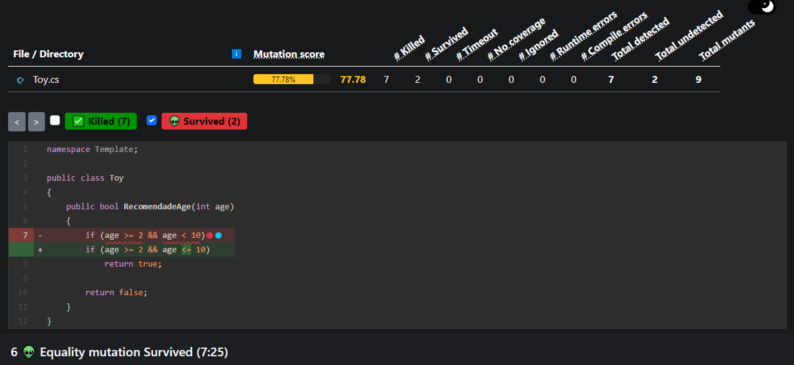
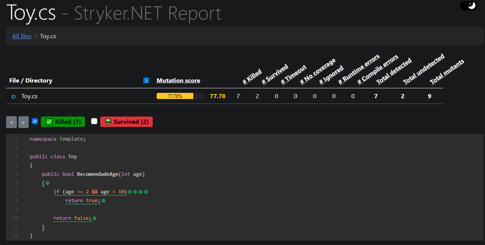

# ForkMutationTesting

Alunos: Frederico Bernardes Wust Stein e Gustavo Bosco.

Nesse trabalho realizamos o fork de um projeto com testes unitários prontos, e executamos o teste de mutação.

Ferramentas utilizadas:

- Xunit para os testes unitários;
- Stryker para os testes de mutação;

A linguagem utilizada foi o C# pois o Stryker é uma biblioteca que oferece testes de mutação exclusivamente para .NET.

Ao executar o Stryker é gerado um relatório onde nele estão presentes os cenários que foram "mortos" pela mutação e aqueles que sobreviveram. Também é possivel visualizar qual foi a mutação realizada pela ferramenmta.

Relatório Geral:

Cenários que sobreviveram a mutação:

Cenários mortos pela mutação:

# Como Executar

Para executar o teste de mutação é necessário ter o .NET instalado e também é preciso instalar a biblioteca do striker.

Para instalar a biblioteca do striker é necessário rodar o comando:

- dotnet tool install -g dotnet-stryker;

Para executar o teste de mutação é necessário rodar o comando:

- dotnet Stryker;

